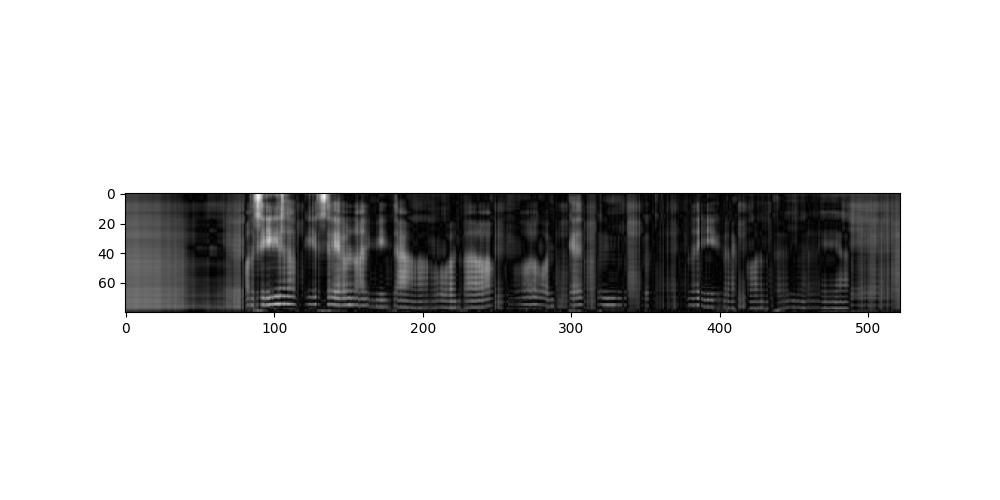

# UTI-to-STFT experiment with Atlas 800 9010 (Ubuntu 18.04)

Tamás Gábor Csapó, Csaba Zainkó, László Tóth, Gábor Gosztolya, and Alexandra Markó, ,,Ultrasound-based Articulatory-to-Acoustic Mapping with WaveGlow Speech Synthesis'', Interspeech 2020. arXiv:2008.03152


## Original Network Link

https://github.com/BME-SmartLab/UTI-to-STFT

## Pre-trained Model Link

Download the keras model file 
- http://smartlab.tmit.bme.hu/csapo/huawei/UTI_to_STFT_CNN_model.h5

Download the sample ultrasound file
- http://smartlab.tmit.bme.hu/csapo/huawei/20180223_spkr048_1432.ult128

## keras-to-tensorflow
- https://github.com/amir-abdi/keras_to_tensorflow

```
keras_to_tensorflow.py --input_model=UTI_to_STFT_CNN_model.h5  --output_model=UTI_to_STFT_CNN_model.pb
```

## Convert model To Ascend om file

create ‘aipp_STFT_tf.cfg’ config file with content:

```
aipp_op { 
aipp_mode : static
related_input_rank : 0
input_format : RGB888_U8
src_image_size_w : 128
src_image_size_h : 64
crop : false
csc_switch : false 
rbuv_swap_switch : false
var_reci_chn_0 : 0.0039216
var_reci_chn_1 : 0.0039216
var_reci_chn_2 : 0.0039216
}
```

convert from .pb model to .om file: 

```
atc --model=./UTI_to_STFT_CNN_model.pb \
    --input_shape "conv2d_1_input:1,64,128,1" \
    --framework=3 \
    --insert_op_conf=./aipp_STFT_tf.cfg \
    --output=./UTI_to_STFT_CNN_aipp \
    --soc_version=Ascend310
```

## UTI-to-STFT inference

```python3 UTI_to_STFT_huawei.py```

result: mel-spectrogram

